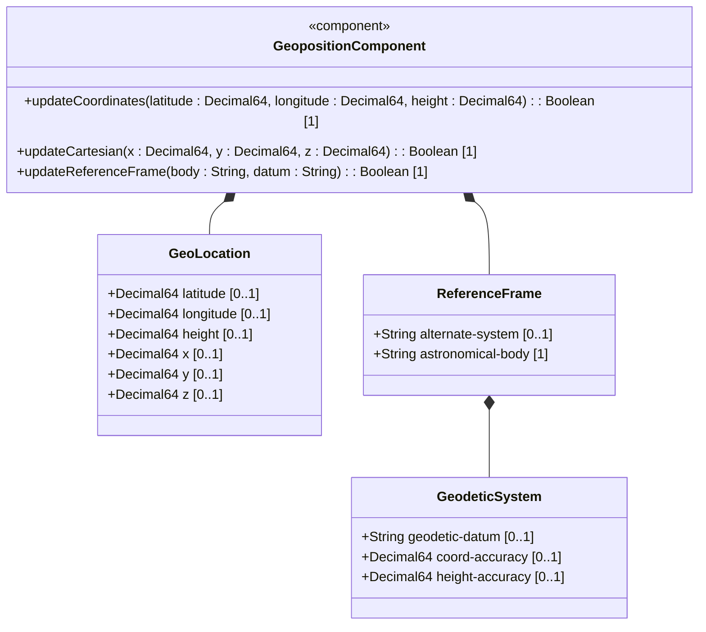
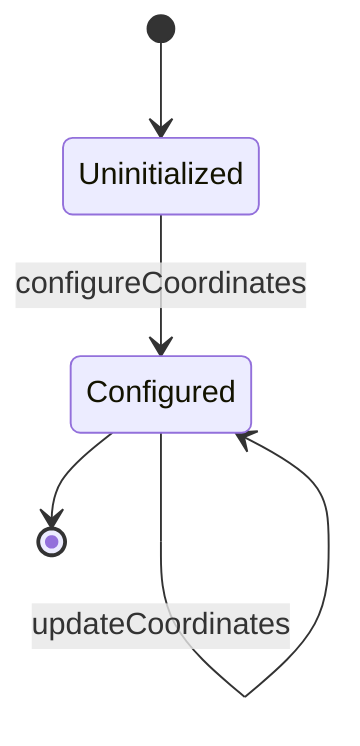

# Epic: Geolocation Position Management

## 1. Context
This Epic covers the Geolocation Position Management subsystem as defined in RFC 9179. It defines the core data structures and interfaces for specifying location coordinates on or around Earth or any other astronomical object. This includes support for both standard ellipsoidal coordinates (latitude, longitude, and height) and Cartesian coordinates (x, y, and z).

## 2. Requirements & Checklist
- [ ] [#102 - Specify Location Coordinates](https://github.com/gintatkinson/digital-pipeline-repo/blob/main/docs/features/feat-01-geo-loc-coordinates.md) (Defines coordinates choices ellipsoid vs cartesian)
- [ ] [#105 - Geographic Location Reference Frame](https://github.com/gintatkinson/digital-pipeline-repo/blob/main/docs/features/feat-02-reference-frame.md) (Defines spatial Reference Frame and geodetic system)

### Associated Use Cases & User Stories

#### Associated Use Cases
- [ ] [#104 - Update Node Location](https://github.com/gintatkinson/digital-pipeline-repo/blob/main/docs/use-cases/uc-01-update-node-location.md) (Standard operational use case for setting/changing coordinates)
- [ ] [#107 - Configure Location Reference Frame](https://github.com/gintatkinson/digital-pipeline-repo/blob/main/docs/use-cases/uc-02-reference-frame.md) (Operational use case for configuring reference frame and geodetic datum)

#### Associated User Stories
- [ ] [#103 - Update Geolocation Coordinates](https://github.com/gintatkinson/digital-pipeline-repo/blob/main/docs/user-stories/us-01-update-coordinates.md) (Defines field-technician interaction with coordinates inputs)
- [ ] [#106 - Configure Location Reference Frame](https://github.com/gintatkinson/digital-pipeline-repo/blob/main/docs/user-stories/us-02-reference-frame.md) (Defines field-technician interaction with reference frame inputs)
## 3. Architecture

## System-Level UML Class Diagram

## System State Machine Diagram

## 4. Operational Considerations
- Coordinates must conform to the Network Management Datastore Architecture (NMDA) defined in RFC 8342.
- Ellipsoidal coordinate systems default to WGS 84.
- Spatial queries must be optimized for virtualized list views and hardware-accelerated mapping views.

## 5. Security & Governance
- Geographic coordinates can be privacy-sensitive. Access controls must restrict read permissions to authorized network administrators.
- High-precision coordinate modifications must be logged.

## 6. Source References
Structural Schema: [ietf-geo-location@2022-02-11.yang](file:///Users/perkunas/jail/dep-tst39/schema/ietf-geo-location@2022-02-11.yang)
Normative Specification: [RFC 9179](https://datatracker.ietf.org/doc/rfc9179/)
