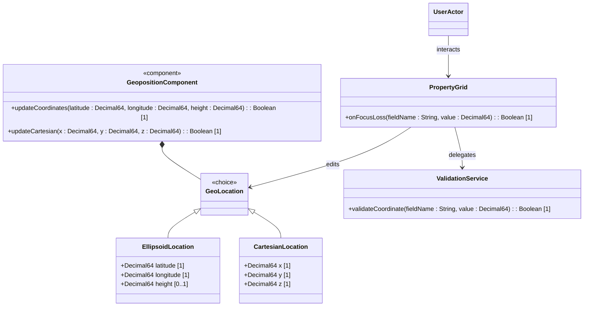

# Feature: Specify Location Coordinates

## Parent Epic
- [ ] [#101 - Geolocation Position Management](https://github.com/gintatkinson/digital-pipeline-repo/blob/main/docs/epics/epic-01-geo-position.md) (Parent Epic)

## Description
This feature provides the capability to configure the geographic coordinates of a network object in either ellipsoidal format (latitude, longitude, and height) or Cartesian format (x, y, and z). It binds to the logical layout of the dashboard view, displaying these attributes in the PropertyGrid panel.

## UML Class Diagram


## Interface Requirements

### 1. Test Data Shape
```json
{
  "location": {
    "choice": "ellipsoid",
    "ellipsoid": {
      "latitude": 37.774929,
      "longitude": -122.419416,
      "height": 15.6
    }
  }
}
```

### 2. Validation & Constraints
- **latitude**: Mandatory for ellipsoidal coordinates. Value range `[-90.0, 90.0]` in decimal degrees, up to 16 decimal places.
- **longitude**: Mandatory for ellipsoidal coordinates. Value range `[-180.0, 180.0]` in decimal degrees, up to 16 decimal places.
- **height**: Optional. Unit of measurement: meters. Up to 6 decimal places.
- **x, y, z**: Mandatory for Cartesian coordinates. Unit of measurement: meters. Up to 6 decimal places.

### 3. Visual Layout & Arrangement
- The input fields are rendered as part of the `PropertyGrid` component, which resides in the bottom-docked `TabbedContainer` (ID: `details_and_relations_tab`).
- The interface layout splits horizontally below the topological canvas via `SplitWorkspace` (ID: `workspace_split`).
- The styling aligns to the high-density grid system (Inter/Roboto font, compact size 12px).
- Viewport dimensions are constrained to prevent layout scroll leakage.

### 4. Interactive Flow & States
- **Choice Toggle**: Toggle button to switch input fields between Ellipsoid and Cartesian modes.
- **Change Buffer**: Text edits are buffered locally. Inputs do not trigger global re-renders on keystroke.
- **Focus Loss Validation**: Fields are validated upon focus loss or edit completion. Error highlights trigger computed style assertions (such as outline red color verification).

## Given-When-Then Acceptance Criteria

### Scenario: Successfully configure ellipsoidal coordinates
Given the PropertyGrid is in Ellipsoid mode
When the user enters 37.774929 in the latitude field, -122.419416 in the longitude field, and 15.6 in the height field
And triggers save
Then the location configuration is updated and saved.

### Scenario: Fail to configure invalid latitude
Given the PropertyGrid is in Ellipsoid mode
When the user enters 95.0 in the latitude field
Then the system highlights the field as invalid and blocks save.

### Scenario: Successfully configure Cartesian coordinates
Given the PropertyGrid is in Cartesian mode
When the user enters 100.5 in x, 200.5 in y, and 300.5 in z fields
And triggers save
Then the location is saved in Cartesian coordinates.

## Specification Context (Verbatim)
"This is the location on, or relative to, the astronomical object.  It is specified using two or three coordinate values.  These values are given either as 'latitude', 'longitude', and an optional 'height', or as Cartesian coordinates of 'x', 'y', and 'z'.  For the standard location choice, 'latitude' and 'longitude' are specified as decimal degrees, and the 'height' value is in fractions of meters.  For the Cartesian choice, 'x', 'y', and 'z' are in fractions of meters.  In both choices, the exact meanings of all the values are defined by the 'geodetic-datum' value."

## 4. Source References
Structural Schema: [ietf-geo-location@2022-02-11.yang](file:///Users/perkunas/jail/dep-tst39/schema/ietf-geo-location@2022-02-11.yang)
Normative Specification: [RFC 9179 Section 2.2](https://datatracker.ietf.org/doc/rfc9179/)

## 5. Logical UI & Layout Bindings
- **Target LUI Component:** PropertyGrid
- **Target Layout Container ID:** details_and_relations_tab
- **Data Source Bindings:** schema:generic-topology/topology[@id='selected_entity']/position/coordinate_mapping
