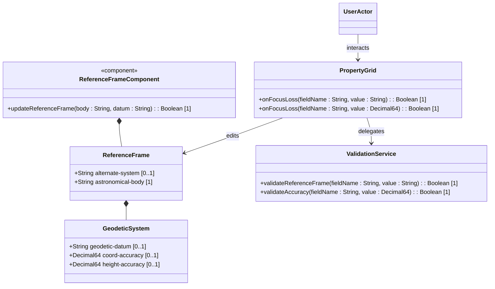

# Feature: Geographic Location Reference Frame

## Parent Epic
- [ ] [#101 - Geolocation Position Management](https://github.com/gintatkinson/digital-pipeline-repo/blob/main/docs/epics/epic-01-geo-position.md) (Parent Epic)

## Description
This feature provides the capability to configure the Reference Frame for a network location, specifying the context in which coordinate values are defined. This includes configuring the astronomical body, geodetic datum, coordinate accuracy, height accuracy, and support for alternate systems (virtual realities). These attributes reside in the geodetic-system container of the reference-frame and are displayed/edited in the PropertyGrid panel of the bottom-docked TabbedContainer.

## UML Class Diagram


## Interface Requirements

### 1. Test Data Shape
```json
{
  "reference-frame": {
    "astronomical-body": "earth",
    "geodetic-system": {
      "geodetic-datum": "wgs-84",
      "coord-accuracy": 0.000005,
      "height-accuracy": 0.1
    },
    "alternate-system": "virtual-reality-grid"
  }
}
```

### 2. Validation & Constraints
- **astronomical-body**: String. Default: `"earth"`. Case-insensitive matching pattern `'^[ -@\[-\^_-~]*$'` (all ASCII values from 32 to 64, and 91 to 126; uppercase letters are excluded). Converts uppercase to lowercase. Preceding "the" is removed. No control characters.
- **geodetic-datum**: String. Allowed characters: ASCII values 32..64, and 91..126. Matches regex pattern `'^[ -@\[-\^_-~]*$'`. Default: `"wgs-84"` when **astronomical-body** is `"earth"`. Converts uppercase to lowercase, and replaces spaces with dashes. No control characters.
- **coord-accuracy**: Decimal64, with fraction-digits 6. Must be non-negative.
- **height-accuracy**: Decimal64, with fraction-digits 6. Must be non-negative. Unit of measurement: meters.
- **alternate-system**: String. Enabled only when the feature `alternate-systems` is active.

### 3. Visual Layout & Arrangement
- The input fields are rendered as part of the `PropertyGrid` component, which resides in the bottom-docked `TabbedContainer` (ID: `details_and_relations_tab`).
- The interface layout splits horizontally below the topological canvas via `SplitWorkspace` (ID: `workspace_split`).
- The styling aligns to the high-density grid system (Inter/Roboto font, compact size 12px).
- Viewport dimensions are constrained to prevent layout scroll leakage.

### 4. Interactive Flow & States
- **Dynamic Defaulting**: Changing the `astronomical-body` to `"earth"` automatically sets the `geodetic-datum` to `"wgs-84"` if not already configured.
- **Auto-Formatters**: Input values are normalized on blur or keypress:
  - `astronomical-body`: Input characters are converted to lowercase; invalid characters (control characters, uppercase letters) are blocked or rejected. Any preceding "the" is removed.
  - `geodetic-datum`: Input spaces are replaced with dashes; characters are converted to lowercase.
- **Focus Loss Validation**: Fields are validated upon focus loss. Invalid inputs trigger red validation highlights.
- **Change Buffer**: Text edits are buffered locally. Inputs do not trigger global re-renders on keystroke.

## Given-When-Then Acceptance Criteria

### Scenario: Successfully configure reference frame with default astronomical body
Given the PropertyGrid is in Reference Frame edit mode
When the user leaves the astronomical-body field blank
Then the system defaults astronomical-body to "earth"
And defaults geodetic-datum to "wgs-84".

### Scenario: Auto-convert uppercase and spaces in geodetic-datum
Given the PropertyGrid is in Reference Frame edit mode
When the user enters "WGS 84" in the geodetic-datum field
Then the system normalizes the value to "wgs-84" on focus loss
And validation passes.

### Scenario: Auto-convert uppercase and remove leading 'the' in astronomical-body
Given the PropertyGrid is in Reference Frame edit mode
When the user enters "The Mars" in the astronomical-body field
Then the system normalizes the value to "mars" on focus loss
And validation passes.

### Scenario: Block invalid characters in geodetic-datum
Given the PropertyGrid is in Reference Frame edit mode
When the user enters a control character or invalid ASCII symbol in the geodetic-datum field
Then the system rejects the input and highlights the field as invalid.

### Scenario: Validate non-negative coordinate accuracy
Given the PropertyGrid is in Reference Frame edit mode
When the user enters -0.0001 in the coord-accuracy field
Then the system highlights the field as invalid and blocks save.

### Scenario: Validate height accuracy fraction digits
Given the PropertyGrid is in Reference Frame edit mode
When the user enters a value with more than 6 fraction digits in the height-accuracy field
Then the system highlights the field as invalid and blocks save.

### Scenario: Configure alternate system when feature is enabled
Given the alternate-systems feature is enabled
And the PropertyGrid is in Reference Frame edit mode
When the user enters "virtual-reality-grid" in the alternate-system field
And triggers save
Then the reference frame alternate-system is updated and saved.

## Specification Context (Verbatim)
"The Frame of Reference for the location values.
An astronomical body as named by the International Astronomical Union (IAU) or according to the alternate system if specified. The ASCII value SHOULD have uppercase converted to lowercase and not include control characters.
A geodetic-datum defining the meaning of latitude, longitude, and height. The default when the astronomical body is 'earth' is 'wgs-84'. The ASCII value SHOULD have uppercase converted to lowercase and not include control characters. The IANA registry further restricts the value by converting all spaces (' ') to dashes ('-').
The accuracy of the latitude/longitude pair for ellipsoidal coordinates, or the X, Y, and Z components for Cartesian coordinates.
The accuracy of the height value for ellipsoidal coordinates; this value is not used with Cartesian coordinates."

## 4. Source References
Structural Schema: [ietf-geo-location@2022-02-11.yang](file:///Users/perkunas/jail/dep-tst39/schema/ietf-geo-location@2022-02-11.yang)
Normative Specification: [RFC 9179 Section 2.2](https://datatracker.ietf.org/doc/rfc9179/)

## 5. Logical UI & Layout Bindings
- **Target LUI Component:** PropertyGrid
- **Target Layout Container ID:** details_and_relations_tab
- **Data Source Bindings:** schema:generic-topology/topology[@id='selected_entity']/position/reference-frame
