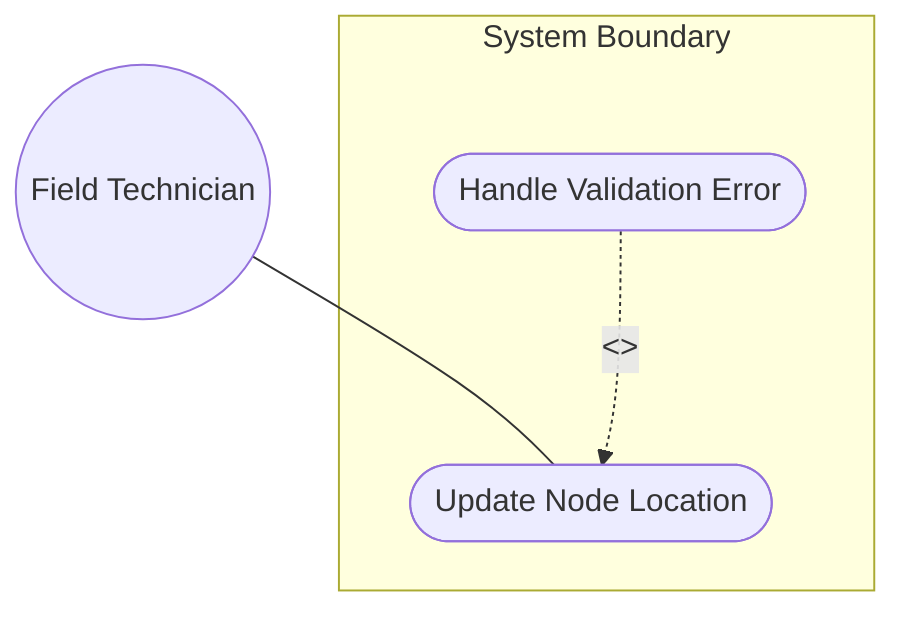
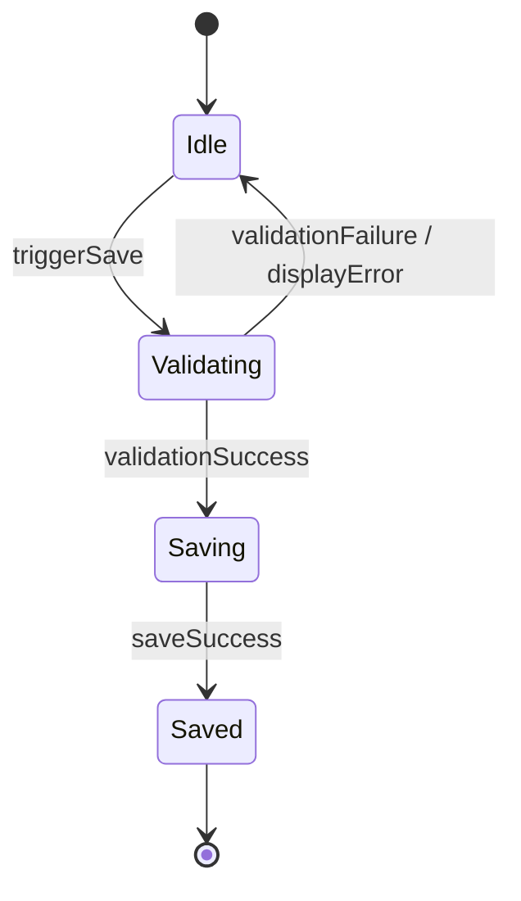

# Use Case: Update Node Location

## Parent Epic
- [ ] [#101 - Geolocation Position Management](https://github.com/gintatkinson/digital-pipeline-repo/blob/main/docs/epics/epic-01-geo-position.md) (Parent Epic)

## 1. Actors
- **Primary Actor:** Field Technician
- **Secondary Actors:** Network Inventory Database

## 2. Preconditions
- The Field Technician is logged into the Network Management Dashboard.
- A valid network node has been selected from the HierarchyTree selector.

## 3. Trigger
The Field Technician selects the location inputs tab in the PropertyGrid panel.

## 4. Main Success Scenario
1. The Field Technician selects the coordinate entry mode (Ellipsoid or Cartesian).
2. The Field Technician inputs the new location coordinates in the PropertyGrid fields.
3. The Field Technician triggers the save action.
4. The System validates the inputs and updates the location values in the database.

## 5. Alternate and Exception Flows
- **5a. Invalid latitude input (Branches from Basic Flow step 3):**
  1. The System detects the latitude value is outside the allowed range of [-90.0, 90.0] degrees, or is missing when in Ellipsoid mode.
  2. The System displays a validation error highlight on the latitude field and blocks the save action.
- **5b. Invalid longitude input (Branches from Basic Flow step 3):**
  1. The System detects the longitude value is outside the allowed range of [-180.0, 180.0] degrees, or is missing when in Ellipsoid mode.
  2. The System displays a validation error highlight on the longitude field and blocks the save action.
- **5c. Invalid height input formatting (Branches from Basic Flow step 3):**
  1. The System detects the height value has more than 6 decimal places.
  2. The System displays a validation error highlight on the height field and blocks the save action.
- **5d. Invalid Cartesian coordinate formatting (Branches from Basic Flow step 3):**
  1. The System detects one of the Cartesian coordinates x, y, z has more than 6 decimal places, or is missing when in Cartesian mode.
  2. The System displays a validation error highlight on the respective coordinate fields and blocks the save action.

## 6. Postconditions
- **Success Guarantee:** The node location values are updated in the Network Inventory Database.
- **Failure Guarantee:** The node location values remain unchanged; the technician is notified of the errors.

## UML Diagrams

### Use Case Diagram

### State Machine Diagram

## 7. Operational Context
"This document defines a generic geographical location YANG grouping. The geographical location grouping is intended to be used in YANG data models for specifying a location on or in reference to Earth or any other astronomical object."

## 8. Realization Matrix

### Required User Stories
- [ ] [#103 - Update Geolocation Coordinates](https://github.com/gintatkinson/digital-pipeline-repo/blob/main/docs/user-stories/us-01-update-coordinates.md) (User story specifying technical interface interactions)

### Required Features
- [ ] [#102 - Specify Location Coordinates](https://github.com/gintatkinson/digital-pipeline-repo/blob/main/docs/features/feat-01-geo-loc-coordinates.md) (Provides coordinates fields and layout bindings)

## Source References
Structural Schema: [ietf-geo-location@2022-02-11.yang](file:///Users/perkunas/jail/dep-tst39/schema/ietf-geo-location@2022-02-11.yang)
Normative Specification: [RFC 9179 Section 2.2](https://datatracker.ietf.org/doc/rfc9179/)
