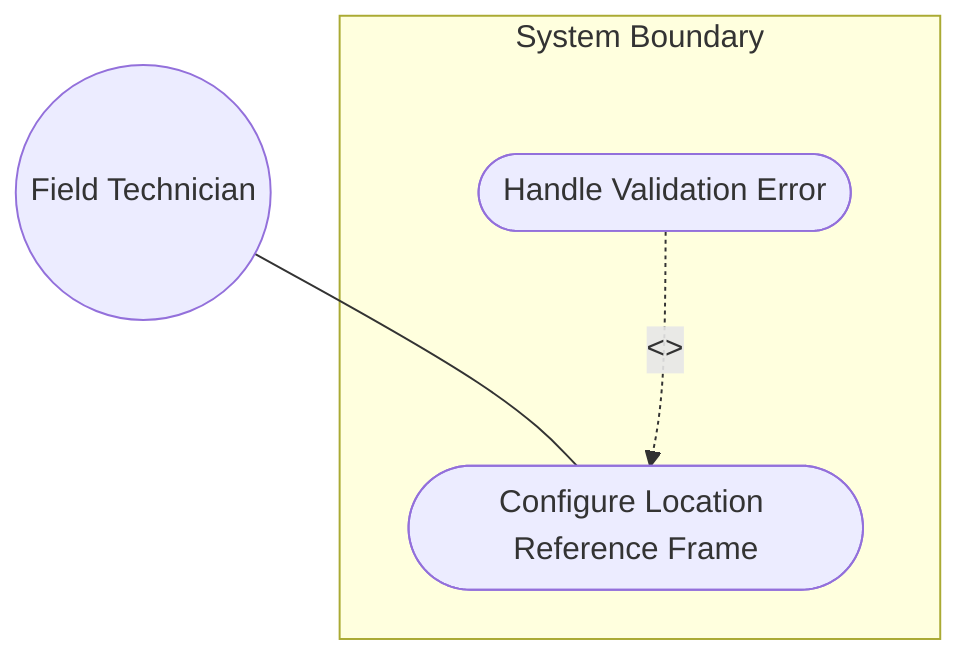
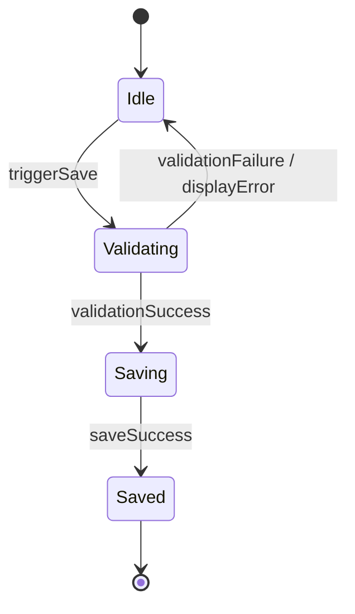

# Use Case: Configure Location Reference Frame

## Parent Epic
- [ ] [#101 - Geolocation Position Management](https://github.com/gintatkinson/digital-pipeline-repo/blob/main/docs/epics/epic-01-geo-position.md) (Parent Epic)

## 1. Actors
- **Primary Actor:** Field Technician
- **Secondary Actors:** Network Inventory Database

## 2. Preconditions
- The Field Technician is logged into the Network Management Dashboard.
- A valid network node has been selected from the HierarchyTree selector.

## 3. Trigger
- The Field Technician selects the reference frame inputs in the PropertyGrid panel.

## 4. Main Success Scenario
1. The Field Technician inputs the Reference Frame details (astronomical body, geodetic datum, coordinate accuracy, and height accuracy) in the PropertyGrid fields.
2. The Field Technician triggers the save action.
3. The System validates the inputs, normalizes values if necessary, and updates the reference frame configuration in the database.

## 5. Alternate and Exception Flows
- **5a. Invalid astronomical-body input (Branches from Basic Flow step 3):**
  1. The System detects the astronomical-body value contains uppercase letters or control characters.
  2. The System attempts to normalize the input (converting uppercase to lowercase and removing leading "the"). If invalid characters remain, it displays a validation error highlight on the astronomical-body field and blocks the save action.
- **5b. Invalid geodetic-datum input (Branches from Basic Flow step 3):**
  1. The System detects the geodetic-datum value contains uppercase letters, spaces, or control characters.
  2. The System attempts to normalize the input (converting uppercase to lowercase and spaces to dashes). If invalid characters remain, it displays a validation error highlight on the geodetic-datum field and blocks the save action.
- **5c. Invalid accuracy inputs (Branches from Basic Flow step 3):**
  1. The System detects that coord-accuracy or height-accuracy has a negative value or has more than 6 decimal places.
  2. The System displays a validation error highlight on the respective accuracy field and blocks the save action.

## 6. Postconditions
- **Success Guarantee:** The node reference frame configuration is updated in the Network Inventory Database.
- **Failure Guarantee:** The node reference frame configuration remains unchanged; the technician is notified of the errors.

## UML Diagrams

### Use Case Diagram

### State Machine Diagram

## 7. Operational Context
"This document defines a generic geographical location YANG grouping. The geographical location grouping is intended to be used in YANG data models for specifying a location on or in reference to Earth or any other astronomical object."

## 8. Realization Matrix

### Required User Stories
- [ ] [#106 - Configure Location Reference Frame](https://github.com/gintatkinson/digital-pipeline-repo/blob/main/docs/user-stories/us-02-reference-frame.md) (User story specifying technical interface interactions)

### Required Features
- [ ] [#105 - Geographic Location Reference Frame](https://github.com/gintatkinson/digital-pipeline-repo/blob/main/docs/features/feat-02-reference-frame.md) (Provides reference frame fields and layout bindings)

## Source References
Structural Schema: [ietf-geo-location@2022-02-11.yang](file:///Users/perkunas/jail/dep-tst39/schema/ietf-geo-location@2022-02-11.yang)
Normative Specification: [RFC 9179 Section 2.2](https://datatracker.ietf.org/doc/rfc9179/)
