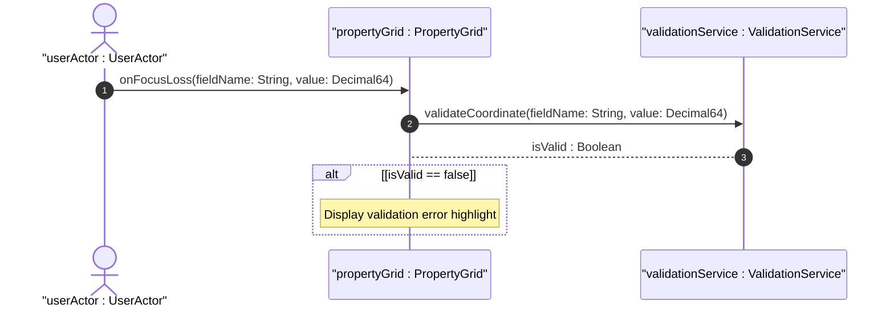

# User Story: Update Geolocation Coordinates

## Parent Epic
- [ ] [#101 - Geolocation Position Management](https://github.com/gintatkinson/digital-pipeline-repo/blob/main/docs/epics/epic-01-geo-position.md) (Parent Epic)

## Domain Object Mapping
- **Primary Domain Objects:** GeoLocation
- **Actor/Role:** userActor : UserActor

## BDD Scenario (OOA/OOD Realization)
**Given** the user is viewing the PropertyGrid panel for a network node
**When** the user modifies a coordinate input field and tab out or shifts focus away
**Then** the PropertyGrid validates the input locally
And displays an error highlight if the value is invalid.

## UML Sequence Diagram

## Operational Context
"At least two options are available to YANG data models that wish to use this grouping with objects that are changing location frequently in non-simple ways. A data model can either add additional motion data to its model directly, or if the application allows, it can require more frequent queries to keep the location data current."

## Required Features Matrix
- [ ] [#102 - Specify Location Coordinates](https://github.com/gintatkinson/digital-pipeline-repo/blob/main/docs/features/feat-01-geo-loc-coordinates.md) (Provides coordinates choice and PropertyGrid integration)

## Source References
Structural Schema: [ietf-geo-location@2022-02-11.yang](file:///Users/perkunas/jail/dep-tst39/schema/ietf-geo-location@2022-02-11.yang)
Normative Specification: [RFC 9179 Section 2.2](https://datatracker.ietf.org/doc/rfc9179/)
