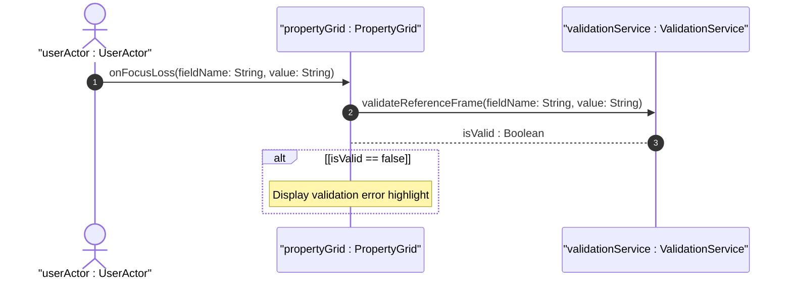

# User Story: Configure Location Reference Frame

## Parent Epic
- [ ] [#101 - Geolocation Position Management](https://github.com/gintatkinson/digital-pipeline-repo/blob/main/docs/epics/epic-01-geo-position.md) (Parent Epic)

## Description
As a Field Technician, I want to configure the Reference Frame for a network node, so that coordinate values are interpreted in the correct spatial context.

## Domain Object Mapping
- **Primary Domain Objects:** ReferenceFrame
- **Actor/Role:** userActor : UserActor

## BDD Scenario (OOA/OOD Realization)
**Given** the user is viewing the PropertyGrid panel for a network node
**When** the user modifies a reference frame input field and tabs out or shifts focus away
**Then** the PropertyGrid validates the input locally
And displays an error highlight if the value is invalid.

## UML Sequence Diagram

## Operational Context
"At least two options are available to YANG data models that wish to use this grouping with objects that are changing location frequently in non-simple ways. A data model can either add additional motion data to its model directly, or if the application allows, it can require more frequent queries to keep the location data current."

## Required Features Matrix
- [ ] [#105 - Geographic Location Reference Frame](https://github.com/gintatkinson/digital-pipeline-repo/blob/main/docs/features/feat-02-reference-frame.md) (Provides reference frame configuration fields and layout bindings)

## Source References
Structural Schema: [ietf-geo-location@2022-02-11.yang](file:///Users/perkunas/jail/dep-tst39/schema/ietf-geo-location@2022-02-11.yang)
Normative Specification: [RFC 9179 Section 2.2](https://datatracker.ietf.org/doc/rfc9179/)
